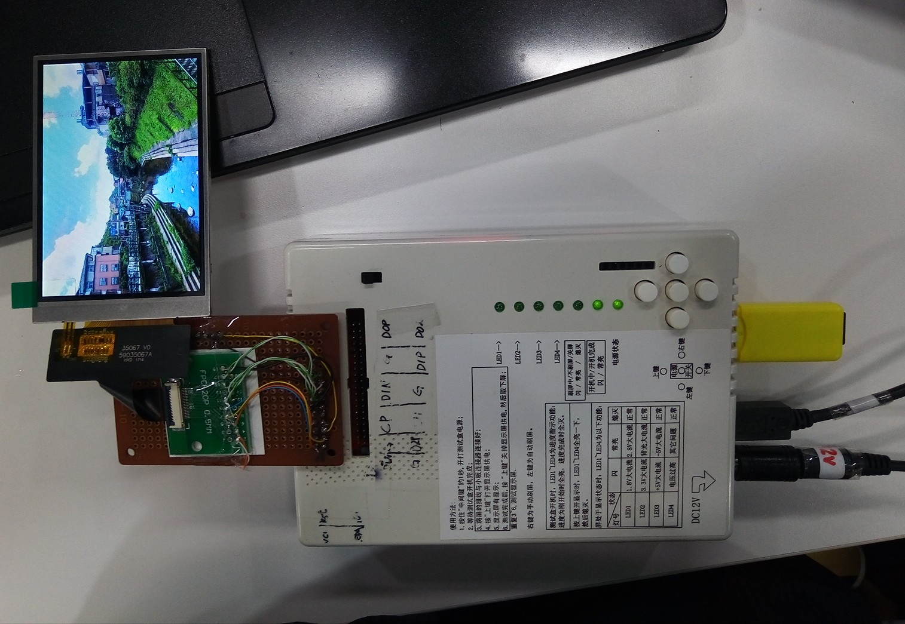
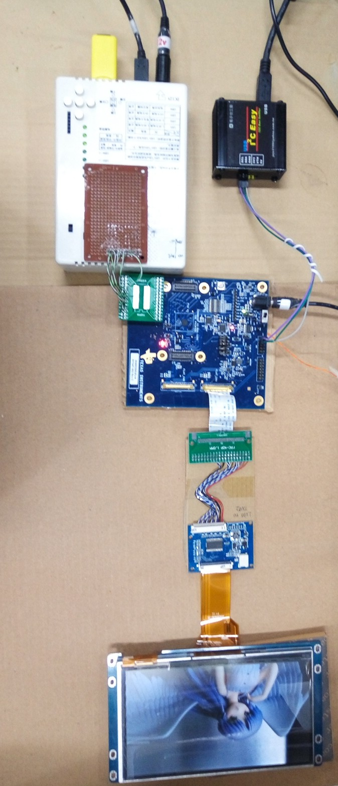
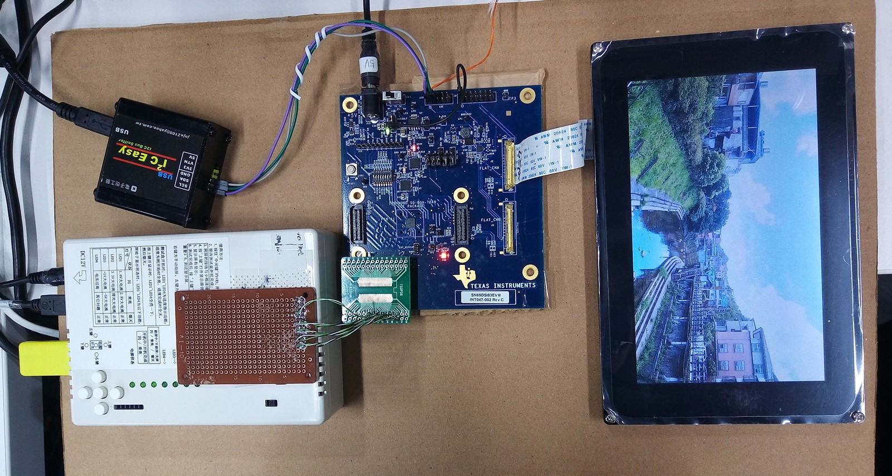

# 深圳富元智FX6

DSI signal generator

setting file for testing LCD

群有电子

MIPI液晶屏、手机显示屏 FHD测试盒 AMOLED TFT屏1920*200

https://item.taobao.com/item.htm?spm=a1z10.1-c.w4004-14195715187.3.3c135244xUJELu&id=543747789589

The i2c.script is txt file and gedit can open them.

## ILI9488_320x480
  
  
## ILI9806_480x800
  
  
## TN92_800x480
  
  
## ws7_1024x600
  
  
